# Payment Flow Diagrams - Mermaid

## 1. Complete Payment Flow

```mermaid
flowchart TD
    Start([Customer Creates Filing]) --> Review[Review Filing Details]
    Review --> Submit[Click Submit Filing]
    Submit --> CreateFiling[Create Filing Document<br/>Status: submitted]
    CreateFiling --> Redirect[Redirect to Checkout Page]
    
    Redirect --> Checkout{Checkout Page}
    
    Checkout --> ServiceFee[💳 Service Fee Payment<br/>Amount: $39.99<br/>Method: Stripe Card]
    Checkout --> IRSPayment[🏛️ IRS Tax Payment<br/>Amount: $550.00<br/>Method: Customer Selects]
    
    ServiceFee --> StripeForm[Stripe Payment Form]
    StripeForm --> StripeProcess[Process via Stripe API]
    StripeProcess --> StripeSuccess{Payment<br/>Success?}
    
    StripeSuccess -->|Yes| ServiceFeePaid[Service Fee Paid<br/>Status: paid]
    StripeSuccess -->|No| StripeError[Show Error<br/>Allow Retry]
    StripeError --> StripeForm
    
    IRSPayment --> SelectMethod{Select IRS<br/>Payment Method}
    
    SelectMethod -->|Option 1| DirectDebit[Direct Bank Debit<br/>⭐ Recommended]
    SelectMethod -->|Option 2| CreditCard[Credit Card<br/>Redirect to IRS]
    SelectMethod -->|Option 3| Check[Check/Money Order<br/>Voucher Provided]
    SelectMethod -->|Option 4| EFTPS[EFTPS<br/>Manual Payment]
    
    DirectDebit --> CollectBank[Collect Bank Details<br/>Routing + Account Number]
    CreditCard --> CreditCardNote[Show Note:<br/>Will receive payment link]
    Check --> CheckNote[Show Note:<br/>Will receive voucher]
    EFTPS --> EFTPSNote[Show Note:<br/>Pay via EFTPS.gov]
    
    CollectBank --> EncryptBank[Encrypt Bank Details]
    CreditCardNote --> StoreMethod
    CheckNote --> StoreMethod
    EFTPSNote --> StoreMethod
    EncryptBank --> StoreMethod[Store Payment Method<br/>in Filing Document]
    
    ServiceFeePaid --> CheckBoth{Both Payments<br/>Ready?}
    StoreMethod --> CheckBoth
    
    CheckBoth -->|Service Fee Paid<br/>IRS Method Selected| UpdateFiling[Update Filing<br/>Status: paid]
    CheckBoth -->|Service Fee Failed| ShowError[Show Error<br/>Block Submission]
    ShowError --> StripeForm
    
    UpdateFiling --> GenerateInvoice[Generate Service Fee<br/>Invoice PDF]
    GenerateInvoice --> SendInvoiceEmail[Send Invoice Email<br/>to Customer]
    
    UpdateFiling --> AgentQueue[Add to Agent Queue<br/>Status: paid]
    
    AgentQueue --> AgentView[Agent Views Filing<br/>in Portal]
    AgentView --> VerifyPayment{Verify<br/>Payments}
    
    VerifyPayment -->|Service Fee Paid ✅<br/>IRS Method Selected ✅| ProcessManual[Agent Processes<br/>Manually in<br/>Quick Truck Tax]
    VerifyPayment -->|Service Fee Not Paid| BlockProcessing[Block Processing<br/>Show Alert]
    
    ProcessManual --> ManualFiling[Agent Files in<br/>Quick Truck Tax<br/>Website]
    
    DirectDebit --> ManualFiling
    CreditCard --> ManualFiling
    Check --> ManualFiling
    EFTPS --> ManualFiling
    
    ManualFiling --> GetSchedule1[Agent Receives<br/>Stamped Schedule 1<br/>from Quick Truck Tax]
    GetSchedule1 --> UploadSchedule1[Agent Uploads<br/>Schedule 1 PDF]
    UploadSchedule1 --> UpdateStatus[Update Filing<br/>Status: completed]
    
    UpdateStatus --> NotifyCustomer[Email Customer:<br/>Schedule 1 Available]
    
    CreditCard --> CreditCardFlow[Customer Receives<br/>Payment Link Email]
    CreditCardFlow --> CustomerPaysIRS[Customer Pays<br/>via IRS Site]
    
    Check --> CheckFlow[Customer Receives<br/>Voucher Email]
    CheckFlow --> CustomerMailsCheck[Customer Mails<br/>Check to IRS]
    
    DirectDebit --> IRSDebits[IRS Debits Customer<br/>Bank Account<br/>24-48 hours]
    
    EFTPS --> CustomerPaysEFTPS[Customer Pays<br/>via EFTPS.gov]
    
    style ServiceFee fill:#e1f5ff
    style IRSPayment fill:#fff4e1
    style DirectDebit fill:#e8f5e9
    style ServiceFeePaid fill:#c8e6c9
    style UpdateFiling fill:#c8e6c9
    style ProcessManual fill:#fff9c4
    style UpdateStatus fill:#c8e6c9
```

---

## 2. Payment Methods Comparison

---

## 3. Agent Manual Processing Flow

---

## 4. Payment Status State Machine

---

## 5. Data Flow Diagram

---

## 6. IRS Payment Method Details

---

## 7. Database Schema

---

## 8. Checkout Page Flow

```mermaid
flowchart TD
    Start([Customer Arrives at Checkout]) --> DisplaySummary[Display Filing Summary]
    
    DisplaySummary --> ShowServiceFee[💳 Service Fee: $39.99<br/>Paid via Stripe]
    DisplaySummary --> ShowIRSTax[🏛️ IRS Tax: $550.00<br/>Select Payment Method]
    
    ShowServiceFee --> StripeForm[Stripe Card Input Form]
    StripeForm --> ProcessStripe[Process Stripe Payment]
    ProcessStripe --> StripeResult{Payment<br/>Result?}
    
    StripeResult -->|Success| ServiceFeePaid[Service Fee Paid ✅]
    StripeResult -->|Failed| StripeError[Show Error<br/>Allow Retry]
    StripeError --> StripeForm
    
    ShowIRSTax --> SelectIRSMethod{Select IRS<br/>Payment Method}
    
    SelectIRSMethod -->|Direct Debit| DirectDebitForm[Direct Debit Form<br/>Routing Number<br/>Account Number<br/>Account Type<br/>Account Holder Name]
    SelectIRSMethod -->|Credit Card| CreditCardInfo[Credit Card Info<br/>Note: Will receive<br/>payment link]
    SelectIRSMethod -->|Check| CheckInfo[Check Info<br/>Note: Will receive<br/>voucher]
    SelectIRSMethod -->|EFTPS| EFTPSInfo[EFTPS Info<br/>Note: Pay via<br/>EFTPS.gov]
    
    DirectDebitForm --> ValidateBank{Validate Bank<br/>Details?}
    ValidateBank -->|Valid| StoreBankDetails[Store Bank Details<br/>Encrypted]
    ValidateBank -->|Invalid| ShowBankError[Show Validation Error]
    ShowBankError --> DirectDebitForm
    
    CreditCardInfo --> StoreMethod
    CheckInfo --> StoreMethod
    EFTPSInfo --> StoreMethod
    StoreBankDetails --> StoreMethod[Store Payment Method<br/>in Filing]
    
    ServiceFeePaid --> CheckReady{Both Ready?}
    StoreMethod --> CheckReady
    
    CheckReady -->|Yes| EnableSubmit[Enable Submit Button]
    CheckReady -->|No| DisableSubmit[Disable Submit Button]
    
    EnableSubmit --> SubmitFiling[Submit Filing]
    SubmitFiling --> UpdateFiling[Update Filing Status: paid]
    UpdateFiling --> Redirect[Redirect to Filing Detail Page]
    
    style ShowServiceFee fill:#e1f5ff
    style ShowIRSTax fill:#fff4e1
    style DirectDebitForm fill:#e8f5e9
    style ServiceFeePaid fill:#c8e6c9
    style SubmitFiling fill:#4caf50,color:#fff
```

---

## 9. Payment Processing Sequence

---

## How to View These Diagrams

### In Cursor/VS Code:
1. Open this file (`PAYMENT_FLOW_MERMAID.md`)
2. Use the Markdown preview (`Cmd+Shift+V` / `Ctrl+Shift+V`)
3. Diagrams will render automatically!

### In GitHub:
- Just push the file to GitHub
- GitHub automatically renders Mermaid diagrams

### Online:
- Copy any diagram code
- Paste at: https://mermaid.live/
- View and edit interactively

---

**Last Updated:** January 2025  
**Status:** Mermaid Diagrams - Easy to View  
**No Installation Required!**
